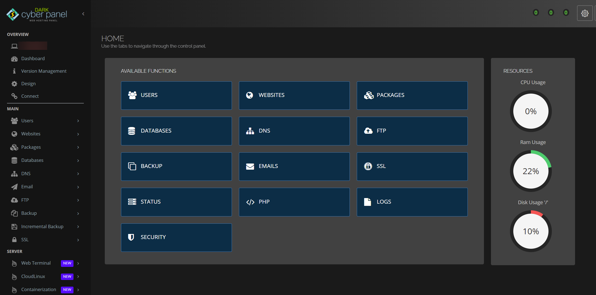

# True Dark CyberPanel Theme

##Copy this entire code into your CyberPanel -> Design Menu > Editor. After that, press "Save Changes" Button to apply it.

This is created by [Ruhani Rabin](https://www.ruhanirabin.com), [A blog post on this](https://rabin.blog/true-dark-theme-cyberpanel-openlitespeed-ui/)
**Kindly give the credit when you modify and apply**

Preview:

